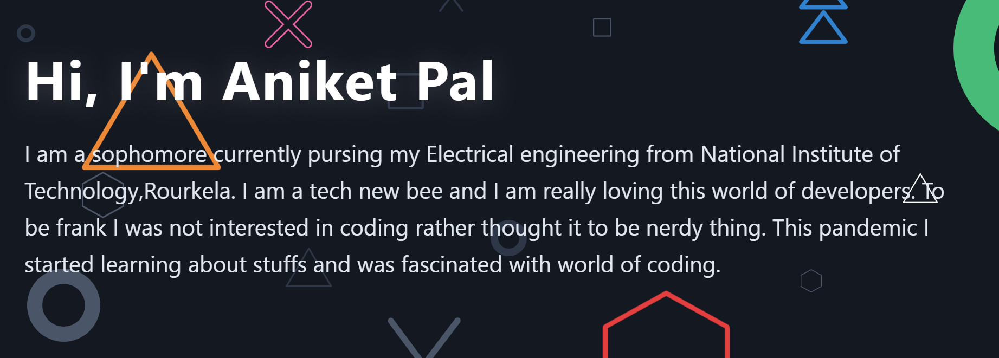

<h1 align="center">Heyoo!  </h1>

 
 
- 🔭 I’m currently working on developing coding skills 
- 🌱 I’m currently focusing on DevOps
- 👯 I’m looking to collaborate on Github
- 🤔 I’m looking for help with websites and python related stuff
- 💬 Ask me about tech related stuff,startup ideas
- 📫 How to reach me: aniketindian8@gmail.com 
- 😄 Pronouns: He/His
- ⚡ Fun fact: I love learning new stuff so it is getting difficult for me to master anything 

	
	
	
	

 

