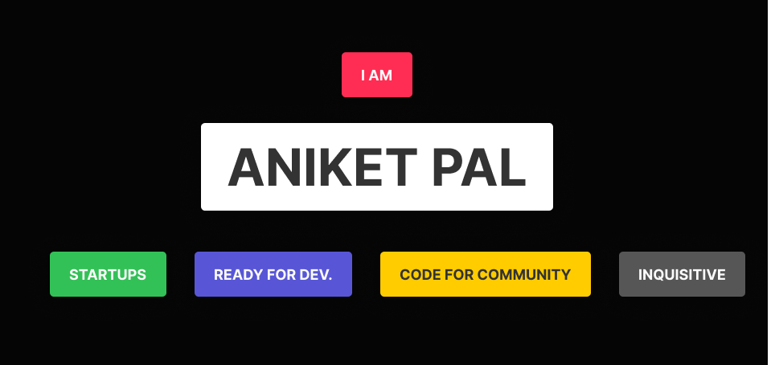

<h1 align="center">Heyoo!  </h1>

 
 
 

- 🔭 I’m currently working on developing coding skills 
- 🌱 I’m currently focusing on DevOps
- 👯 I’m looking to collaborate on Github
- 🥅 2021 Goals: Be a better human 
- 💬 Ask me about anything
- 📬 How to reach me: aniketindian8@gmail.com 
- 🧗 I try to: Go beyond and push the bounds
- ⚡ Oneday I will make it happen 

 

	
	
	
	
	
	

&nbsp; &nbsp;

<h3 align='center'>Show some &nbsp;❤️&nbsp; by starring some of the repositories! </h3> 
